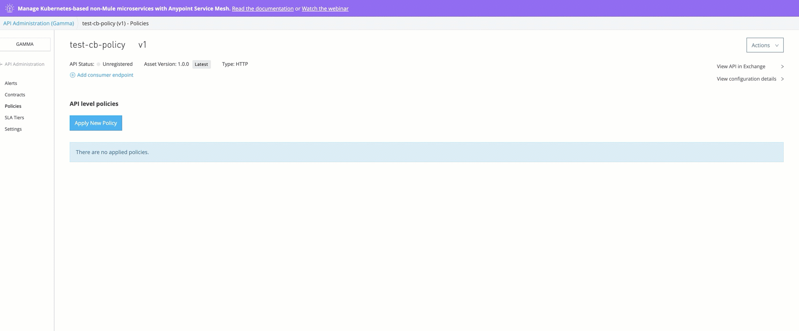

# Circuit-Breaker Custom Policy

This is a custom policy that implements a lightweight Circuit Breaker pattern for Mule 4. Applying this to your API you would be able to:

  - Define an error threshold giving your API the flexibility to fail as many times you defined before tripping the circuit
  - Define a retry period after which the protected API should allow incoming requests.
  - Define a timeout for the incoming requests (WIP)
  - Perform dynamic exception handling

### Why?
When working on layered architecture (API Led is a good example) it doesn't make sense to propagate the incoming requests when we know that some component of this architecture is not working correctly. This policy provides an entry point for the consumer, preventing spreading calls through the different layers, giving time to failing resources to recover.

### How?
This policy handles a deterministic model that indicate the state of the circuit. It uses the Mule Object Store (OS) to save and retrieve the values after each call.

This way, when the OS is initializated is using the ${appId} property as key, as shown below:


This ensure that every application that uses this policy has isolated circuit state values.

### Usage
After publishing to Exchange, follow these steps to apply the policy to an existing managed API:

* Log into Anypoint Platform
* Enter API Manager
* Click on the API version for the application you want to apply the policy to
* Click on Policies (at your left. No! your other left :P)
* Click on Apply New Policy
* Filter by 'Custom' category and select 'circuit-breaker-mule-4'. Click on 'Configure Policy' button
* Give value to the policy's parameters:



| Parameter | Purpose |
| ------ | ------ |
| timeout| WIP.see todo's. Specify the maximum number of seconds that a consumer can wait after sending a request|
| failureThreshold | maximum number of errors allowed before tripping the circuit (putting it in OPEN state) |
| retryPeriod | number of seconds the pattern will wait before trying to reach depedent components (underlying APIs) when a new request is received |
| exceptionsArray | a comma separated string containing the exception types that are expected to trip the circuit. Example: "MULE:COMPOSITE_ROUTING, HTTP:UNAUTHORIZED, MULE:EXPRESSION" |

### Testing the Policy in Studio

* Use the attached mule-application `test-app-cb` to test the policy.
* Configure the application to use the `api.id`
    ```
       -Dhttp.port=8089
       -Danypoint.platform.client_id=<<CLIENT_ID>>
       -Danypoint.platform.client_secret=<<CLIENT_SECRET>>
       -Dapi.id=<<API ID>>
    ```
     
* `curl --location --request GET 'http://localhost:8089/alive' --header 'triggerFail: true'`

Once applied, the policy will return the following structure when an error listed in the `exceptionsArray` occurs in the application (if it is propagated):

```
HTTP/1.0 503 Service Unavailable
Content-Type:application/json; charset=UTF-8
transfer-encoding:chunked
Connection:keep-alive

{
  "circuitBreaker": {
    "timeout": 30,
    "failureThreshold": 5,
    "retryPeriod": 30,
    "state": "CLOSED",
    "timestamp": "2020-08-06T13:58:09.875-07:00",
    "errorCount": 1,
    "error": "HTTP GET on resource 'http://httpstat.us:80/400' failed: bad request (400)."
  }
}
```

**Response body for different Circuit Breaker states**

##### CLOSED
```
    {
      "circuitBreaker": {
        "timeout": 30,
        "failureThreshold": 5,
        "retryPeriod": 30,
        "state": "CLOSED",
        "timestamp": "2020-08-06T13:58:09.875-07:00",
        "errorCount": 1,
        "error": "HTTP GET on resource 'http://httpstat.us:80/400' failed: bad request (400)."
      }
    }
```

##### OPEN
```
    {
      "circuitBreaker": {
        "timeout": 30,
        "failureThreshold": 5,
        "retryPeriod": 30,
        "state": "OPEN",
        "timestamp": "2020-08-06T13:58:48.9-07:00",
        "errorCount": 6,
        "error": "The circuit is still open, not propagating new requests until 2020-08-06T13:59:18.9-07:00"
      }
    }
```

##### HALF-OPEN
```
    {
      "circuitBreaker": {
        "timeout": 30,
        "failureThreshold": 5,
        "retryPeriod": 30,
        "state": "HALF-OPEN",
        "timestamp": "2020-08-06T14:02:00.147-07:00",
        "errorCount": 7,
        "error": "HTTP GET on resource 'http://httpstat.us:80/400' failed: bad request (400)."
      }
    }
```

All values ​​are self-explanatory except for errorCount. This value is a counter and stores the amount of requests that has been sent to the API and has failed, opening the circuit again. Other field that deserves an explanation is error. If the underlying API is who is tripping the circuit for the inmmediate request, then the error is populated with error.description value propagated by the protected API. If other case the error is returned by the policy itself saying "The circuit is still open, not propagating new requests until ${DATE}". 

Please refer to the following sequence diagram for an example:


#### Development

The following commands are required during development phase

| Task | Command |
| ------ | ------ |
| Package policy| mvn clean install |
| Publish to Exchange | mvn deploy |

##### Dependencies
This policy uses a persistent Object Store as a key value database that allows maintaining the state of the circuit at every time. It also uses the http transport extension module, to perform the update of headers in the response in case of error.

### Contribution

Want to contribute? Great!

Just fork the repo, make your updates and open a pull request!

### Todos
 - Add timeout capability
 - Write Tests
 - Improve performance

License
----
MIT