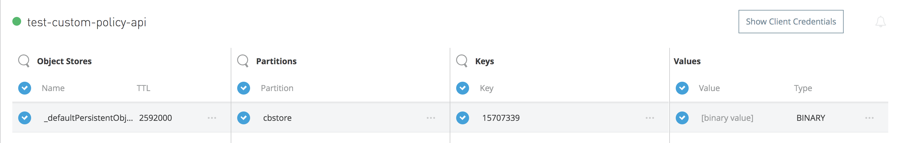
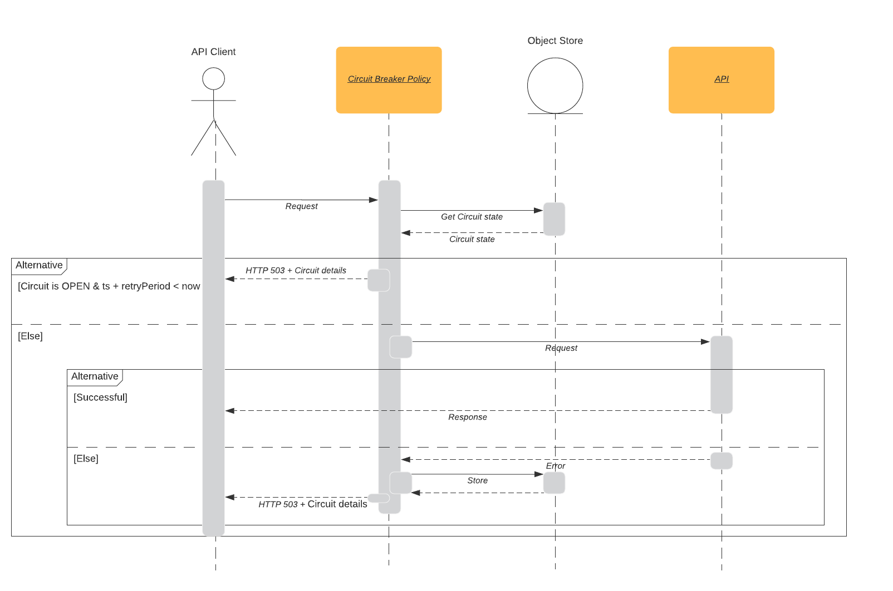
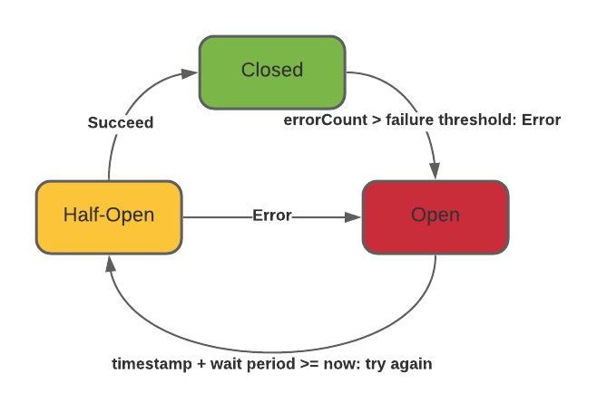

# Circuit-Breaker Custom Policy

This is a custom policy that implements a lightweight Circuit Breaker pattern for Mule 4. By applying this policy to your API, you would be able to:

  - Define an error threshold giving your API the flexibility to fail as many times as you define before tripping the circuit
  - Define a retry period after which the protected API should allow incoming requests
  - Set the circuit to HALF-OPEN state after the threshold is reached and service is still not functional
  - Perform a dynamic exception handling

### Why?
When working on a layered architecture (API Led is a good example) it doesn't make sense to propagate the incoming requests when we know that one of the components of this architecture is not working correctly. This policy provides an entry point for the consumer, preventing spreading calls through the different layers, allowing time to failing resources to recover.

### How?
This policy handles a deterministic model that indicates the state of the circuit. It uses the Mule Object Store (OS) to save and retrieve the values after each call.

When the application starts, OS is initializated using the ${appId} property as key, as shown below:


This ensures that every application that uses this policy has isolated circuit state values.

*NOTE* OS settings can be overriden if needed when configuring the policy.

### Usage
After publishing to Exchange, follow these steps to apply the policy to an existing managed API (or proxy):

* Log into Anypoint Platform
* Enter API Manager
* Click on the API version for the application you want to apply the policy to
* Click on Policies
* Click on Apply New Policy
* Filter by 'Custom' category and select 'circuit-breaker-mule-4'. Click on 'Configure Policy' button
* Give value to the policy's parameters:

| Parameter | Purpose |
| ------ | ------ |
| Failure Threshold | maximum number of errors allowed before tripping the circuit (putting it in OPEN state) |
| Retry Period | number of seconds the pattern will wait before trying to reach depedent components (underlying APIs) when a new request is received |
| Evaluate the error object to trigger the circuit? | - Checkbox - Select this option if the underlying application propagates the error object. E.g. applications not handling errors or raising custom ones on error handling strategies |
| Exceptions Array | a comma separated string containing the exception types that are expected to trip the circuit. Example: "MULE:COMPOSITE_ROUTING, HTTP:UNAUTHORIZED, MULE:EXPRESSION" |
| Evaluate the HTTP response to trigger the circuit? | - Checkbox - Select this option to evaluate the HTTP response (status code). Check this option if evaluate error object option is unchecked.    |
| HTTP Codes Array | Specify all the HTTP codes that can trip the circuit. The default value is 500 (Internal Server Error). Expect a comma separated string. Example: "500, 401". Double quotes are required but spaces between types are not. |
| Override Object Store settings? | - Checkbox - Select this option to override default OS settings. Defaut OS will use persistent OS, with 1 hour entry TTL. |
| Object Store's entry TTL | The entry timeout. Default value is 1 (hour). |
| Object Store's entry TTL unit | The time unit. Default value is "HOURS". You can choose one of the listed options based on https://docs.oracle.com/javase/7/docs/api/java/util/concurrent/TimeUnit.html|

Additionally, this policy has the resourceLevelSupported boolean attribute set to true to allow policy support at the resource level.

Once applied, the policy will return the following structure when an error occurs in the application (if it is propagated):

```
HTTP/1.0 503 Service Unavailable
Content-Type:application/json; charset=UTF-8
transfer-encoding:chunked
Connection:keep-alive

{
    "circuitBreaker": {
        "failureThreshold": 1,
        "retryPeriod": 20,
        "state": "OPEN",
        "timestamp": "2019-11-12T14:59:42.942Z",
        "errorCount": 5,
        "error": "meaningful message"
    }
}
```

All attributes of the response ​​are self-explanatory, except for errorCount and error. 
errorCount is a counter that stores the number of requests that has been sent to the API and failed, opening the circuit again. 
error is an attribute that is populated depending on the scenario: if the underlying API is the one who is tripping the circuit for the inmmediate request, then the error is populated with error.description value propagated by the protected API. Otherwise, the error is returned by the policy itself saying "The circuit is still open, not propagating new requests until ${DATE}". 

Please refer to the following sequence diagram for an example:


### States transition

The transition of states can be explained as follows:

- We start with the circuit in CLOSED state
- If the underlying service throws an error, we count it until we reach the maximum number of errors allowed set by the Failure Threshold, then we trip the circuit (OPEN)
- If a new incoming request arrives, we reject it immediately, unless the timestamp of the last error plus the Retry Period that we have configured exceeds the current timestamp. In that case, we transition to HALF-OPEN state and we propagate the incoming request
- If we get an error from that last request, we increment the counter and transition back to OPEN, but, if the request was sucessfull, we clear the error counter and we transition to CLOSED again

#### Development

The following commands are required during development phase

| Task | Command |
| ------ | ------ |
| Package policy| mvn clean install |
| Publish to Exchange | mvn deploy |

##### Dependencies
This policy uses a persistent Object Store as a key value database that allows maintaining the state of the circuit at every time. It also uses the http transport extension module, to perform the update of headers in the response in case of error.

### Contribution

Want to contribute? Great!

* For public contributions - Just fork the repo, make your updates and open a pull request!
* For internal contributions - Use a simplified feature workflow following these steps:
   - Clone your repo
   - Create a feature branch using the naming convention feature/name-of-the-feature
   - Once it's ready, push your changes
   - Open a pull request for a review

### Todos
 - Write Tests
